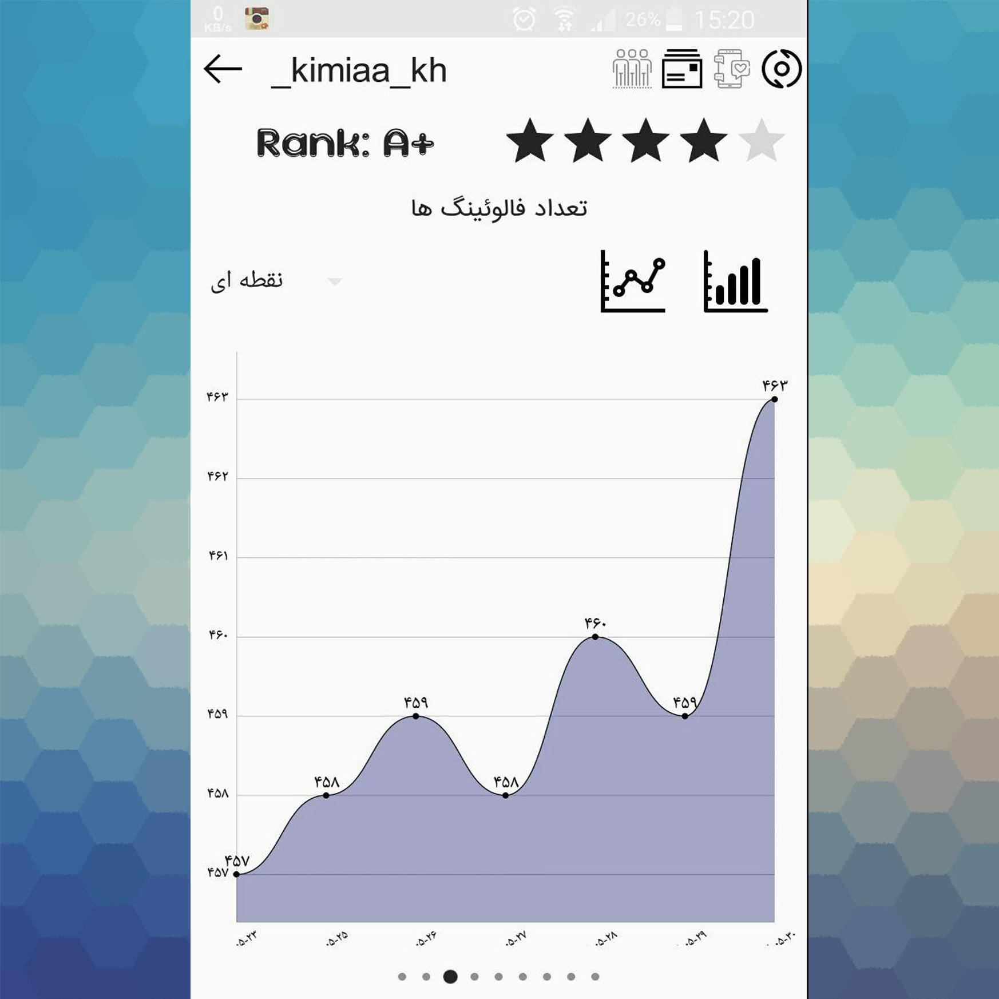

# Metagram

Metagram is an Android application written in Java as an analytical tool for Instagram users in Persian language

It provides reports and graphs about any Instagram account that the user has access ot it. Below you can see some sample reports and graphs.

### Reports:

 

### Graphs:

